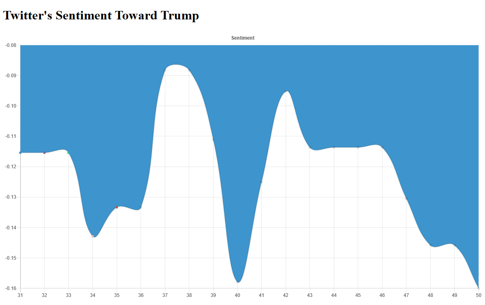

### TMP-Index
Attempt to gauge the impact Trump's tweets have on the stock market.
Currently Shows Twitter's Sentiment Toward Trump

## Update

* Twitter Stream up and running on Trumps Tweets.
* The GCloud SQL DB might be set up; yet to use it/test it.
* Connected to (local) DB and sucessfully executed queries
* Added [MeaningCloud API](https://www.meaningcloud.com/developer/apis) for sentiment analysis.

## ToDo

* Rate tweets from condensed_2018... positive, negative, or netural to begin training a sentiment analysis model (Custom Model)
* Filter out tweets that don't relate to the market, economy, or ongoing trade-wars.
* Finish implementing storage class. Currently goal is to aggregate twitter data and store it in a GCloud DB by twitter handle.
* Add a sentiment class to guage the sentiment of trumps tweets.

# If you want to install yourself
* NEED TO FILL OUT
